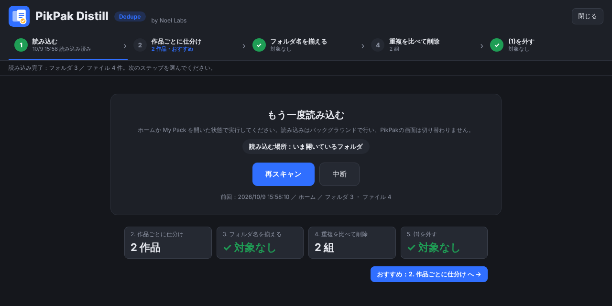
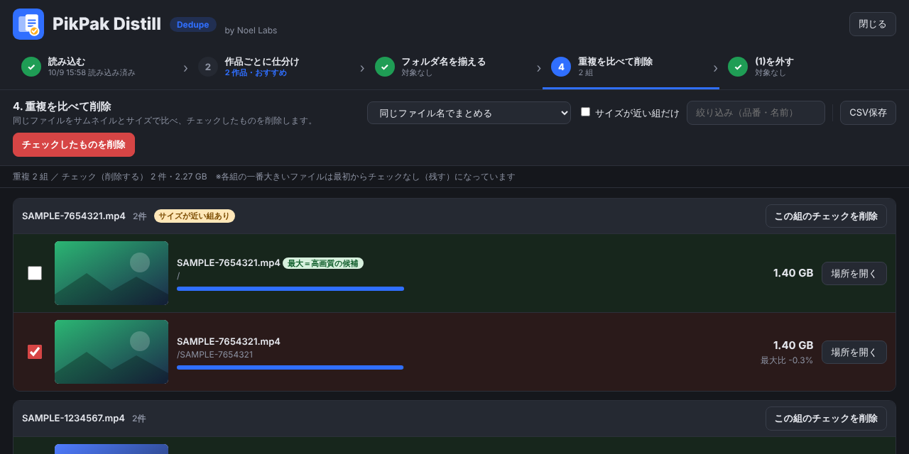

  

<h1 align="center">PikPak Distill – Dedupe</h1>

  PikPak の重複ファイルを、サムネイルとサイズで見比べて整理するユーザースクリプト 
  by Noel Labs

  <a href="https://raw.githubusercontent.com/Noel-Labs39/pikpak-distill/main/pikpak-distill.user.js"><b>▶ インストール</b></a>
  ・
  <a href="LICENSE">MIT License</a>

## できること

| 機能 | 内容 |
| --- | --- |
| 重複比較 | 開いているフォルダ以下をスキャンし、同じファイル名（または同じ品番）のファイルをグループ化。サムネイル・サイズ・場所を並べて表示します。各組で一番大きいファイルを「高画質の候補」として残し、それ以外にチェックを入れます |
| 削除 | チェックしたファイルを、一括または組ごとに削除。通常は PikPak のゴミ箱へ移動し、確認画面で「ゴミ箱を経由せず完全に削除」も選べます |
| 作品ごとに仕分け | 1つのフォルダに複数の作品が混在している場合、そのフォルダの中に品番フォルダを作って振り分けます。同名フォルダがあればそこへ移動し、同名ファイルがあれば `(1)` を付けます |
| フォルダ名の整合 | フォルダ名を中のファイル名（品番）に揃えます。同名フォルダがある場合は `(1)` を付けて重複を回避します |
| (1) を外す | 重複を削除したあと、不要になった `(1)` をフォルダ名・ファイル名から外します |

処理はすべて PikPak の API をバックグラウンドで呼び出して行うため、画面が切り替わることはありません（数百フォルダのスキャンでも 1 分程度）。

## インストール

1. ブラウザに [Tampermonkey](https://www.tampermonkey.net/) を入れます（Chrome / Brave / Edge / Firefox など）。
2. 上の **▶ インストール** を開き、Tampermonkey の画面で「インストール」を押します。
3. 以後、このリポジトリが更新されると Tampermonkey が自動で新しい版に更新します。

## 使い方

1. [PikPak](https://mypikpak.com/) にログインし、ホーム（または My Pack）を開きます。
2. 右下の **Distill** ボタンを押すと、メニューが開きます。「おまかせ整理」で 6 つのステップを順に進めるか、作業を 1 つ選んで開けます。左から順に進めるだけです。

| ステップ | 内容 |
| --- | --- |
| 1. 読み込む | 開いているフォルダ以下を読み込みます。**ここを実行するまで、2〜6 は押せません** |
| 2. ファイル名を整える | FC2 のファイル名からサイト名・広告などを消して `FC2-PPV-品番(-番号)` にそろえます（使うかどうか選べます） |
| 3. 作品ごとに仕分け | 混在フォルダを品番ごとのフォルダに分けます |
| 4. フォルダ名を揃える | フォルダ名を中のファイル名（品番）に揃えます |
| 5. 重複を比べて削除 | チェックを確認して削除します（まずは「この組のチェックを削除」で 1 組だけ試すのがおすすめ） |
| 6. (1)を外す・片付け | 空フォルダをゴミ箱へ移し、不要になった (1) を外します。削除後に「1. 読み込む」で読み込み直してから実行します |

- 各ステップには対象の件数が表示され、次にやるべきステップに「おすすめ」が付きます。対象がないステップは ✓ になります。
- 2・3・4・6 には「先頭1件だけ試す」があります。初めて使うときは 1 件だけ試してから一括実行してください。

## 動作環境

- PikPak Web（`https://mypikpak.com/`）
- 標準の画面、[PikPak Enhancement Master](https://github.com/digbug82/PikPak_Enhancement_Master) の画面のどちらでも動作します（併用可）

## 注意事項

- 認証には、ログイン中の PikPak 画面がブラウザに保存している情報を使います。認証情報を外部へ送信することはありません。
- 実行直前に最新の状態を取得し、名前や場所が想定と違う場合は処理を止めます。
- 完全削除（ゴミ箱を経由しない削除）は元に戻せません。
- 本ツールは PikPak の非公式ツールです。PikPak の仕様変更により動作しなくなる場合があります。
- 本ツールの利用によって生じたいかなる損害についても、作者は責任を負いません（MIT License）。

## ライセンス

[MIT](LICENSE) © 2026 Noel Labs
